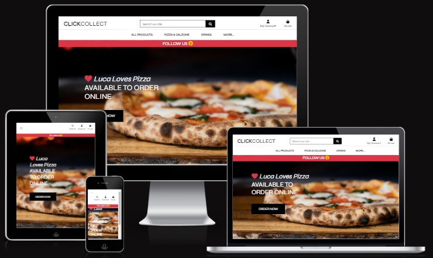
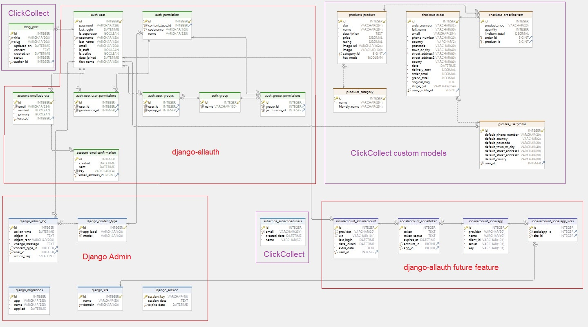

<h2 align="left"></h2>

## Project Purpose

This is a Code Institute student project for Milestone 4, built to satisfy the requirements for the EKC Training Diploma (Level 5) in [Web Application Development](https://www.ekcgroup.ac.uk/ekc-training/computing/web-application-development-diploma-level-5). 

This project has been created in order to provide a community CRUD application on a deployed interactive website. The project was built using **Gitpod**. 

The information has been presented in a way that ensures the users achieve their goals of:
* understanding what the site's function is
* understanding how to create, read, update and delete their own records or posts
* being able to register, log in and log out of this community site

The site also enhances the owner's goals by:
* showcasing their database design skills
* showcasing their Python programming skills
* showcasing their Django skills
* showcasing their back-end development skills by allowing users to change data in a PostgreSQL relational database with the aid of the Django web-framework.

## Project Requirements

* The technologies used were HTML, CSS, **Python, Django and PostgreSQL**.
* This interactive back-end project contains pages to enable users to create, read, update and delete user records in a relational database
* This README.md file explains what the project does and the value it provides for the users
* Version control is provided by Git and GitHub
* External code, libraries, templates, images, information, etc. will be listed in the **Credits**, at the bottom of this README.
* This project is deployed via **Heroku**. The code stored in a GitHub repository, whilst the data is stored in the relational PostgreSQL database hosted by **ElephantSQL**.

---

<h1 align="left">Django Web App with PostgreSQL: ClickCollect</h1>

[View the live project here.](#)

The aim of the project is to provide a supplementary app for local hospitality businesses offering a food takeaway service. Whilst many of these business offer an online table booking service, they do not have a select, pay and collect (or delivery) facility for takeaway food.

This site is created for my friend Jason Firth who owns the [**Luca Loves PIZZA**](https://www.lucalovespizza.co.uk/) pizza van service in Warwickshire and the West Midlands. He travels with his pizza van to local events and festivals. Jason usually operates the service by himself and at the moment mainly takes orders via WhatsApp messenger, but it would make life easier if this part of the business could be automated. 

This app is inspired by [Zari Restaurant](https://www.zarirestaurant.co.uk/indian-takeaway-in-crawley/) in Crawley, West Sussex. I used their online takeaway facility many times, whilst working away. I would order my meal, pay for it and select a time slot for collection on the way home.

The site is designed to be responsive and accessible on a range of devices, making it easy to use for potential users.

<h2 align="left"></h2>

---

## Table of Contents
1. [**UX**](#ux)
    - [**User Stories**](#user-stories)
    - [**Owner Goals**](#owner-goals)
    - [**Design**](#design)
        - [**The CRUD App**](#the-crud-app)
        - [**Framework**](#framework)
        - [**Colour Scheme**](#colour-scheme)
        - [**Typography**](#typography)
        - [**Imagery**](#imagery)
    - [**Wireframes**](#wireframes)
    - [**Relational Database**](#relational-database)

2. [**Features**](#features)
    - [**Current Features**](#current-features)
        - [**Navigation**](#navigation)
        - [**Home Page**](#home-page)
        - [**About**](#about)
        - [**Log In**](#log-in)
        - [**Register**](#register)
        - [**Profile**](#profile)
        - [**Add product**](#add-product)
        - [**Add Category**](#add-category)
        - [**Log Out**](#log-out)
        - [**404 Page**](#404-page)
    - [**Future Features**](#future-features)

3. [**Technologies Used**](#technologies-used)
    - [**Design Tools**](#design-tools)
    - [**Front-End**](#front-end)
    - [**Back-End**](#back-end)
    - [**Validation and Evaluation**](#validation-and-evaluation)

4. [**Manual Testing**](TESTING.md)
    - [**Supported Browsers and Screen Sizes**](TESTING.md/#supported-browsers-and-screen-sizes)
    - [**Testing Against User Stories**](TESTING.md/#testing-against-user-stories)
    - [**Test Cases**](TESTING.md/#test-cases)
    - [**Code Validation**](TESTING.md/#code-validation)
    - [**Site Audit**](TESTING.md/#site-audit)
    - [**Compatibility**](TESTING.md/#compatibility)
    - [**Bugs Found**](TESTING.md/#bugs-found)
    - [**Known Issues**](TESTING.md/#known-issues)

5. [**Automated Testing**](TESTING.md/#automated-testing)
    - [**Unit Testing Using ChatGPT**](TESTING.md/##unit-testing-using-chatgpt)

6. [**Deployment**](DEPLOYMENT.md)
    - [**Local Deployment**](DEPLOYMENT.md/#local-deployment)
    - [**Remote Deployment**](DEPLOYMENT.md/#remote-deployment)

7. [**Credits**](#credits)
    - [**Media**](#media)
    - [**Code**](#code)
    - [**Acknowledgements**](#acknowledgements)

---

## UX

### User stories

:white_check_mark: *denotes current features*

"**_As a user, I would like to_** _____________________________"

- :white_check_mark: *add, update or delete items from shopping bag*.
- :white_check_mark: *keep my information secure*.
- :white_check_mark: *order and pay for products*.
- :white_check_mark: *see my order history*.
- :white_check_mark: *use the site without logging in*.
- :white_check_mark: *subscribe to a newsletter*.
- :white_check_mark: *view the site owner's blog*.

### Owner goals

"**_As an owner, I would like to_** _____________________________"

- :white_check_mark: *build a Django app*.
- :white_check_mark: *allow users to store their data via the app*.
- :white_check_mark: *build a bolt-on ecommerce app to assist local food businesses, which do not have a takeaway order and payment section*.
- :white_check_mark: *build an app to be visually attractive*.

### Design

#### The CRUD App

- This app was influenced by the Code Institute full stack e-commerce tutorial for [Boutique-Ado](https://github.com/ckz8780/boutique_ado_v1), by [Chris Z](https://github.com/ckz8780).

- What is a CRUD app? This type of app allows the user to create, read, update and delete records or posts in a database via graphical interface. In this case the PostgreSQL database is hosted by [ElephantSQL](https://www.elephantsql.com/) and as the app is developed with [Python 3.8](https://www.python.org/downloads/release/python-3811/), the graphical interface is provided by HTML5 and the mini-framework, [Django 3.2](https://docs.djangoproject.com/en/4.2/releases/3.2.19/) with [Bootstrap v4.6](https://getbootstrap.com/docs/4.6/getting-started/introduction/).

- Why this app? Many restaurants have a takeaway service where customers can order over the telephone, but surprisingly very few offer an online order, payment and delivery/collection service. With the arrival of the pandemic and the shortage of hospitality staff, may establishments would benefit from such a service. Many local businesses are on a strict budget, so this app is designed to be a bolt-on feature built by ClickCollect for use with any restaurant website. This particular site was designed for a mobile pizza van service located in the West Midlands. The business owner's photographs are used to display the products for sale. A search facility on keywords allows the user to search though the products on offer. The site does not require login, but profile and checkout pages do. All products are visible to every one, but only the site owner (superuser) can add, edit or delete the the product details. 

- View the project design flowchart to see which Django apps are associated with which templates of the app:

<h2 align="left"></h2>

#### Framework

- [Bootstrap 4.6](https://getbootstrap.com/docs/4.6/getting-started/introduction/) is popular framework for building responsive, mobile-first sites, with jsDelivr and a template starter page..
- [jQuery 3.5.1](https://code.jquery.com/jquery/) was used for minimal JavaScript programming.
- [Django 3.2.19](https://docs.djangoproject.com/en/4.2/releases/3.2.19/) is a web framework used to render the back-end Python with the front-end Bootstrap.

#### Colour Scheme

The following Bootstrap [colour scheme](https://getbootstrap.com/docs/4.6/utilities/colors/) was chosen for simplicity,  readability and lends itself nicely to the subject of flame baked pizzas.

<h2 align="left"></h2>

#### Typography

Bootstrap v4.6 uses [native font stack](https://getbootstrap.com/docs/4.6/content/typography/) that selects the best font-family for each OS and device. For a more inclusive and accessible type scale, it uses the browser’s default root font-size (typically 16px) so visitors can customize their browser defaults as needed.

#### Imagery

In general, all pages have the Bootstrap white background with dark grey or black text. Added splashes of colour are provided by the Bootstrap red colour class '.bg-danger', hex: #DC3545.

### Wireframes

View the wireframe PDF [here](docs/ux/wireframe-mp4.pdf).

The pages contain the same functionality and look the same on every device, with the exception to the menus and the number of product cards displayed across the screen.

#### Tablet 

- Home

<h2 align="left"></h2>

- Profile

<h2 align="left"></h2>

- Add / Edit Products Form

<h2 align="left"></h2>

- Categories

<h2 align="left"></h2>

- Register

<h2 align="left"></h2>

- Log In

<h2 align="left"></h2>

- Logged Out

<h2 align="left"></h2>

- Top Header

    <h2 align="left"></h2>

#### Desktop

- Home

<h2 align="left"></h2>

- Other Pages - same as for tablet

#### Mobile

- Home

<h2 align="left"></h2>

- Other Pages - same as for tablet

### Relational Database

This projects uses a PostgreSQL database hosted by ElephantSQL.

<h2 align="left"></h2>

Database Entity Relationship Diagram (PostgreSQL)

<h2 align="left"></h2>

Table Examples

* Products
<h2 align="left"></h2>

---

## Features

### Current Features

* This app consists of nine user pages for:
    - Home
    - Products
    - Product Detail
    - Log In, Register
    - Profile
    - Shopping Bag
    - Checkout
    - Log Out
    - Blog List
    - Blog Article
    - Newspaper Subscription
* Plus two additional administrator (superuser) pages for:
    - Add Product
    - Edit Product
* And a further set of in-built Django error pages e.g. 404, 500
 

#### Navigation :compass:

Navigation bar will be the default responsive Bootstrap one.

* Desktops

   The main menu items in bold:

    - **ClickCollect** branding
    - **Search** our site box
    - **My Account** with dropdown menu for:
        - Register
        - Login
        - Product Management (Administrator only)
        - My Profile
        - Logout
    - **Shopping Bag**

    will be inline with the Search box and fixed across the top of the screen. Underneath will be *Product* and *More* menu items:

    - **All Products** with dropdown menu for:
        - By Price
        - By Rating
        - By Category
        - All Products
    - **Pizza & Calzone** with dropdown menu for:
        - Meat
        - Vegetarian
        - Vegan
        - All Pizza
    - **Drinks** with dropdown menu for:
        - Cold drinks
        - Hot Drinks
        - All Drinks
    - **More...** with dropdown menu for:
        - Our blog
        - Subscribe 
    
    which will be inline and fixed just above the red *NO COLLECTION FEE!* banner. 
    
    All dropdown menu items will have dark grey text on a white background and on hover, a light grey backgound.

* Mobiles 
    - will feature the collapsed Bootstrap navigation with a hamburger icon inline along the top of the screen with:

        - **Search** icon with dropdown search box
        - **My Account** with dropdown menu for:
            - Register
            - Login
            - Product Management (Administrator only)
            - My Profile
            - Logout
        - **Shopping Bag** 

    - selecting the hamburger icon will reveal a dropdown menu with black text on a white background:

        - **All Products** with dropdown menu for:
            - By Price
            - By Rating
            - By Category
            - All Products
        - **Pizza & Calzone** with dropdown menu for:
            - Meat
            - Vegetarian
            - Vegan
            - All Pizza
        - **Drinks** with dropdown menu for:
            - Cold drinks
            - Hot Drinks
            - All Drinks
        - **More...** with dropdown menu for:
            - Our blog
            - Subscribe 
    

#### Home Page :bouquet:

Anyone (guest, member, administrator) can view this page which features a hero image with a call to action **ORDER NOW** button.

#### Register :bust_in_silhouette::heavy_plus_sign:

Anybody can *register* for free and create their own unique profile to store their own order history.

#### Log In :bust_in_silhouette:

This facility is created using the Django-allauth package built on top of Django's own authentication and authorisation framework. This provides a comprehensive set of tools to handle user authentication and registration in Django projects.

#### Profile :lock:

An inbuilt Django decorator protects user profiles. Only the current logged-in user can view **past order detail** page or update default address information. 

#### Past Order Detail :bookmark_tabs:

Logged-in users can view a past order page from their profile, with the following information:
- email address used for order confirmation
- order information
- order details
- credit card address
- billing information

#### Logout :point_right:

This is a separate page where the user either confirms to signing out or cancels the action. 

#### Shopping Bag :handbag:

Users can see which items they have added to their bag. Here, they can view the grand total, update the item quantity, remove the item, keep shopping or go to the secure checkout.

#### All Products :takeout_box:

#### Product Detail :pizza:

Only the **administrator** can view the links to Edit or Delete the current product.

#### Our Blog :memo::pencil:

#### Newsletter Subscription :newspaper:

#### 404 Page :no_entry:

#### 500 Page :warning:

#### Product Management :card_index_dividers:

Only the **administrator** can view the page to Add a product.

#### Add Category :card_index_dividers::heavy_plus_sign:

Only the **administrator** can view this page in order to add categories.

### Future Features

- Allow users to change their passwords.
- Allow users to 'rate' products.

---

## Technologies Used

* Cloud developer platform from [Gitpod](https://www.gitpod.io/).
* IDE integrated into Gitpod from [Visual Studio Code](https://code.visualstudio.com/).
* Debugging assisted by [Chrome Developer Tools](https://developer.chrome.com/docs/devtools/).
* Version control integrated into Gitpod from [Git](https://git-scm.com/).

### Design Tools

* Wireframes from [Balsamiq](https://balsamiq.com/).
* Native font stack from [Bootstrap](https://getbootstrap.com/docs/4.6/content/reboot/#native-font-stack).
* Colour palette generated by [Bootstrap](https://getbootstrap.com/docs/4.6/utilities/colors/).
* Icon library and toolkit from [Font Awesome 5](https://fontawesome.com/).
* 'CC' avicon created on [favicon.cc](https://www.favicon.cc/).
* GitHub static badges from [Shields.io](https://shields.io/badges)
* Online photo editor from [Pixlr](https://pixlr.com/x/).
* Stock photos from [Unsplash](https://unsplash.com).
* Product photos from Jason Firth
* Showcasing the site on different devices by [Bytes](https://ui.dev/amiresponsive)
* Paint from [Microsoft](https://apps.microsoft.com/store/detail/paint/9PCFS5B6T72H?hl=en-us&gl=us)
* Snip and Sketch from [Microsoft](https://apps.microsoft.com/store/detail/snipping-tool/9MZ95KL8MR0L?hl=en-gb&gl=gb)
* PDF Reader from [Adobe Acrobat Reader](https://www.adobe.com/uk/)
* Flowchart by [diagrams.net/draw.io](https://www.diagrams.net/)
* PostgreSQL ERD created by [DbSchema](https://dbschema.com/)

### Front-End

- 
    - [HTML5](https://developer.mozilla.org/en-US/docs/Web/Guide/HTML/HTML5) as the base for markup text.
- 
    - [CSS3](https://developer.mozilla.org/en-US/docs/Web/CSS) for custom styling the site.
- 
    - [jQuery 3.5.1](https://code.jquery.com/jquery/) for JavaScript functionality.
- 
    - [Bootstrap 4.6](https://getbootstrap.com/docs/4.6/getting-started/introduction/) is a popular framework for building responsive, mobile-first sites.

### Back-End

- 
    - [Python 3.8.12](https://www.python.org/) is a high-level, general-purpose programming language.
- 
    - [Django 3.2.19](https://docs.djangoproject.com/en/4.2/releases/3.2.19/) is a web framework written in Python.
- 
    - [Django-allauth 0.41.0](https://django-allauth.readthedocs.io/en/latest/) for authentication and authorisation.
- 
    - [Heroku](https://www.heroku.com) is used as *"Platform as a Service"* (PaaS) for app hosting.
- 
    - [PostgreSQL](https://www.postgresql.com/) is used as a relational database plugin via Heroku.

### Validation and Evaluation

* HTML validation from [W3C](https://validator.w3.org/#validate_by_input).
* CSS validation from [Jigsaw (W3C)](https://jigsaw.w3.org/css-validator/).
* Python validation from [CI Python Linter](https://pep8ci.herokuapp.com/).
* JavaScript validation from [JSHint](https://jshint.com/).
* Site audit by [Lighthouse](https://developer.chrome.com/docs/lighthouse/overview/).

---

## Project Testing

See the document [TESTING.md](TESTING.md) for the code validation, site evaluation and manual tests.

---

## Deployment

See the document [DEPLOYMENT.md](DEPLOYMENT.md) for local and Heroku deployment.

---

## Credits

A huge thank you to the following people and organisations, because without you, the website would not have been produced in it's present form.

### From the Course

Heroku deployment instructions from Code Institute video tutorial

Readme styling from Tim Nelson's project [Unicorn Attractor](https://github.com/TravelTimN/ci-milestone05-fsfw)

Markdown Cheatsheet from [Adam Pritchard](https://github.com/adam-p/markdown-here/wiki/Markdown-Cheatsheet#html)

### Media

Favicon created on [favicon.cc](https://www.favicon.cc/)

Emoji shortcodes from [Ikatyang](https://github.com/ikatyang/emoji-cheat-sheet/blob/master/README.md) on GitHub

### Code

Although this project is the work of the author, the code is based on the [Boutique Ado Tutorial](https://github.com/Code-Institute-Solutions/boutique_ado_v1) by Chris Z for Code Institute.

Other code sourced from or inspired by others have references embedded as links throughout this document and indicated by the active blue text links.

The Blog App code is based on the Djangocentral tutorial [Building A Blog Application With Django](https://djangocentral.com/building-a-blog-application-with-django/) by Abhijeet Pal

Subscription page code based on the Python Lessons tutorial [Introduction no Subscribers and Newsletter #18](https://www.youtube.com/watch?v=wl4Yxo5_Cgw) by Rokas Liuberskis

---

## Acknowledgements

Rachel Furlong - [EKC Training](https://ekcgroup.ac.uk/business-units/ekc-training) Course Facilitator, for generous support and advice.

Rohit Sharma - [Code Institute](https://codeinstitute.net/) Mentor, for the continuous feedback and guidance in industry standards.

 

---

## Gitpod Reminders

To run the Django app in Gitpod, type:

`python3 manage.py runserver`

To update the requirements.txt

`pip3 freeze --local > requirements.txt`

To install the the requirements.txt

`pip3 install -r requirements.txt`

To run a frontend (HTML, CSS, Javascript only) application in Gitpod, in the terminal, type:

`python3 -m http.server`

A blue button should appear to click: _Make Public_,

Another blue button should appear to click: _Open Browser_.

To run a backend Python file, type `python3 app.py`, if your Python file is named `app.py` of course.

A blue button should appear to click: _Make Public_,

Another blue button should appear to click: _Open Browser_.

In Gitpod you have superuser security privileges by default. Therefore you do not need to use the `sudo` (superuser do) command in the bash terminal in any of the lessons.

To log into the Heroku toolbelt CLI:

1. Log in to your Heroku account and go to *Account Settings* in the menu under your avatar.
2. Scroll down to the *API Key* and click *Reveal*
3. Copy the key
4. In Gitpod, from the terminal, run `heroku_config`
5. Paste in your API key when asked

You can now use the `heroku` CLI program - try running `heroku apps` to confirm it works. This API key is unique and private to you so do not share it. If you accidentally make it public then you can create a new one with _Regenerate API Key_.

------

